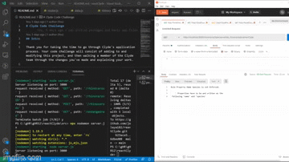

# Rhino Search


Backend application that allows you to do searches on 
rhinoceros data using koa


## to get the repo:

```
git clone https://github.com/jolaya182/reactB.git

```

To install:
```
npm  i
```
## Running the project

If you have Node.js installed locally you can run the project from the `src` directory with `npm start`. Be sure to install the node modules first with `npm install`

If you don't have Node.js installed locally you can either download it [here](https://nodejs.org/en/download)


Start the `dev server`:
```
npx nodemon server.js
```
## Intro

This project is a simple JSON API written in Node.js, using the Koa framework. It currently contains two routes:

| Method | Path         | Description                                |
| ------ | ------------ | ------------------------------------------ |
| GET    | /rhinoceros  | Returns all Rhinos that have been created  |
|        |              | and can be filtered by parameters suchas   |
|                       | name and species                           |
| POST   | /rhinoceros  | Adds a new Rhino to the collection         |
| GET    | /rhinocerosID| Returns the rhino with that Id             |
| GET    | /endangered  | Returns all Rhinos that are endangered     |


## requirements

### 1. The API has specific route to get Rhinos by its ID

### 2. The following validation has been added to create Rhino route

- The body of the request must contain a `name` key with a string value between 1 and 20 characters in length.
- The body of the request must contain a `species` key with a string value representing the species of the Rhino to be added. This value must be one of the following: `white_rhinoceros`, `black_rhinoceros`, `indian_rhinoceros`, `javan_rhinoceros`, `sumatran_rhinoceros`
- The body should contain no additional keys.

If the above criteria are not met the application returns an appropriate error response.

### 3. Get All Rhinos route has filter by parameters

The  user can pass in additional parameters on their request that allow them to do the following:
- Return all Rhinos of a specified species 
- Return all Rhinos with the specified name

### 4. An endangered route has been added to return Endangered Rhinos

For the purpose of this problem, a species is considered endangered when there are only one or two individuals of that species in the data.

## Node Modules

The following node modules are used as part of the project and you may wish to reference their documentation as you work through the problems below:
- [koa](http://koajs.com)
- [koa-router](https://www.npmjs.com/package/koa-router)
- [koa-bodyparser](https://www.npmjs.com/package/koa-bodyparser)
- [uuid](https://www.npmjs.com/package/uuid)


## Testing the API
 Use Postman.

[You can get postman here](https://www.getpostman.com/apps)

## Trouble Shoot

for windows users
If you are trying to run the test and
If you get one of the following:
`'jest' is not recognized as an internal or external command`

use `npm i -g jest`

`Cannot find module '@babel/preset-env'`

use `npm uninstall @babel/preset-env`
then use `npm i -D @babel/preset-env `